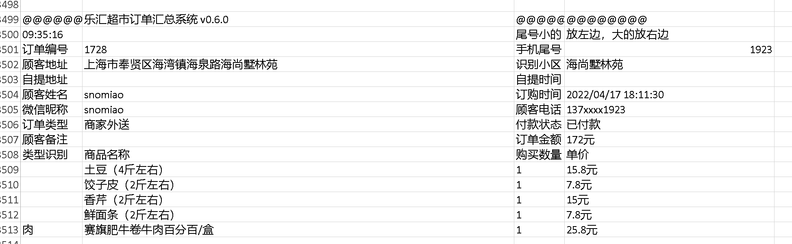

# 微信小店超市订单汇总系统

乐汇 (或者别的什么超市、小卖部、零售店) 超市订单汇总系统。

## 用户界面

## 输入格式（小程序导出）

## 导出格式（导出之后，打印出来分拣用）

## Change Log

All notable changes to this project will be documented in this file.
See [Conventional Commits](https://conventionalcommits.org) for commit guidelines.

### [0.6.2](https://github.com/snomiao/lehui/compare/lehui@0.6.1...lehui@0.6.2) (2022-04-20)

**Note:** Version bump only for package lehui

### 0.6.1 (2022-04-19)

#### Bug Fixes

- address update ([3be36b1](https://github.com/snomiao/lehui/commit/3be36b1b5ce945bc41aa2e7ea5550b10be96b89b))
- 小区解析 ([6275d1b](https://github.com/snomiao/lehui/commit/6275d1b413c51410ba9b7e208e23f6f6034fc9a6))
- 界面优化、地址识别逻辑优化 ([7bfe0c9](https://github.com/snomiao/lehui/commit/7bfe0c9ea00e28305427ac486d7ccfa10c654c22))
